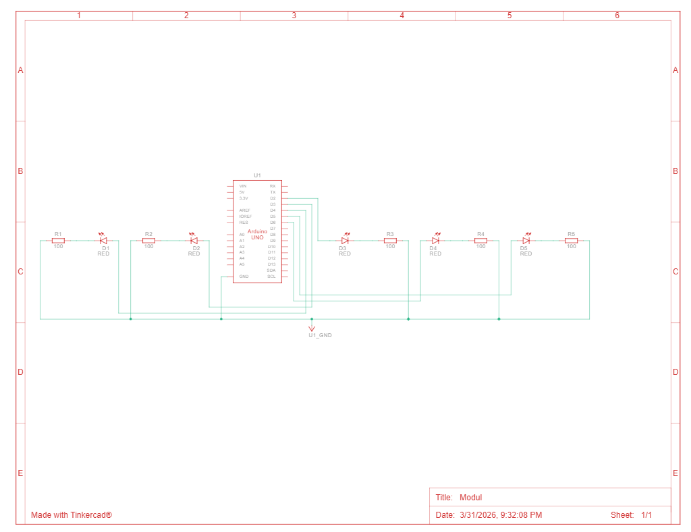

# Jawaban Pertanyaan Praktikum Modul 1 - Percabangan

1. Gambarkan rangkaian schematic dari 5 LED running yang digunakan pada percobaan


2. Jelaskan bagaimana program membuat efek LED berjalan dari kiri ke kanan!
```c
for (int ledPin = 6; ledPin >= 2; ledPin--) {
    // menghidupkan pin:
    digitalWrite(ledPin, HIGH);
    delay(timer);
    // mematikan pin:
    digitalWrite(ledPin, LOW);
}
```
Perulangan `for` ini menginisiasi variabel `ledPin` menjadi bervalue `7` lalu melakukan "blink" yang diulang dengan value dari `ledPin` yang dinamis. Auto decrement dari `ledPin--` membuat setiap lampu mengalami hal yang sama—blink, mulai dari 6,5,4, 3, sampai dengan 2.

3. Jelaskan bagaimana program membuat LED kembali dari kanan ke kiri!
```c
for (int ledPin = 2; ledPin < 7; ledPin++) {
    // hidupkan LED pin nya:
    digitalWrite(ledPin, HIGH);
    delay(timer);
    // matikan pin LED nya:
    digitalWrite(ledPin, LOW);
    }
```
Perulangan `for` di sini menginisiasi variabel `ledPin` menjadi bervalue `2` lalu melakukan "blink" yang diulang dengan value dari `ledPin` yang dinamis. Auto increment dari `ledPin++` membuat setiap lampu mengalami hal yang sama—blink, mulai dari 2,3,4,5 sampai dengan 6.

4. Buatkan program agar LED menyala tiga LED kanan dan tiga LED kiri secara bergantian
```c
int timer = 300;

void setup() {
    for (int ledPin = 2; ledPin < 7; ledPin++) {
        pinMode(ledPin, OUTPUT);
    }
}

void loop() {
    // menyalakan 3 lampu di kiri
    digitalWrite(2, HIGH);
    digitalWrite(3, HIGH);
    digitalWrite(4, HIGH);
    delay(timer); // lama waktu menyala

    // mematikan 3 lampu di kiri
    digitalWrite(2, LOW);
    digitalWrite(3, LOW);
    digitalWrite(4, LOW);
    delay(timer); // lama waktu mati

    // menyalakan 3 lampu di kanan
    digitalWrite(4, HIGH);
    digitalWrite(5, HIGH);
    digitalWrite(6, HIGH);
    delay(timer); // lama waktu menyala

    // mematikan 3 lampu di kanan
    digitalWrite(4, LOW);
    digitalWrite(5, LOW);
    digitalWrite(6, LOW);
    delay(timer); // lama waktu mati
}
```